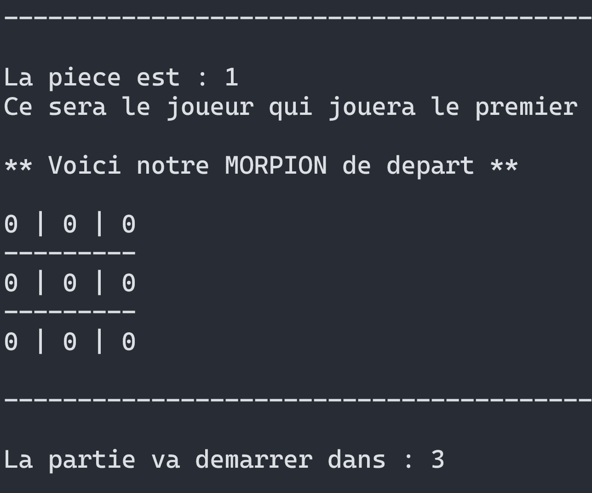

# Tic-Tac-Toe

This is a C++ implementation of the classic Tic-Tac-Toe game. The game features a console-based interface and allows player and computer to compete against each other.

## How to Compile and Run

To compile the code, you need to have a C++ compiler installed on your system, such as g++. From the terminal, navigate to the directory containing the source code files (tictactoe.cpp) and execute the following command:

```bash
g++ -o tictactoe.exe tictactoe.cpp
```

This will compile the code and generate an executable file named tictactoe.exe. You can then run the executable to start the game:

```bash
./tictactoe.exe
```

## How to Play

The game follows the standard rules of Tic-Tac-Toe. Players take turns marking empty cells in a 3x3 grid. The objective is to be the first to form a horizontal, vertical, or diagonal line of three consecutive marks (X or O).

To select a cell to place your mark, enter the row and column numbers when prompted.

## Screenshot



Have fun playing Tic-Tac-Toe!
Feel free to customize and extend the code as needed. If you encounter any issues or have suggestions for improvements, please don't hesitate to open an issue on GitHub. Contributions are welcome!
